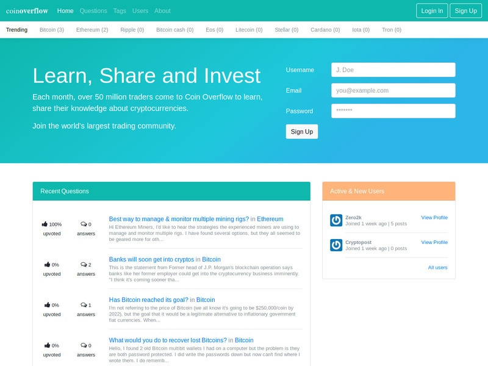

bth_ramverk1_project - coinOverflow
==================================

[](https://travis-ci.org/Zero2k/bth_ramverk1_project)
[](https://scrutinizer-ci.com/g/Zero2k/bth_ramverk1_project/build-status/master)
[](https://scrutinizer-ci.com/g/Zero2k/bth_ramverk1_project/?branch=master)
[](https://scrutinizer-ci.com/g/Zero2k/bth_ramverk1_project/?branch=master)

## About coinOverflow

This website is part of the last assignment in the course ramverk1 at BTH. coinOverflow is a fully functioning forum with inspiration from stackoverflow and reddit.



## Install your own version

```
git clone https://github.com/Zero2k/bth_ramverk1_project.git
```

## Install dependencies

```
make update OR composer update
```

## Add Database to Project

```
cd config/
touch database.php

CODE:

<?php

return [
    "dsn"             => "mysql:host=localhost;dbname=dbname",
    "username"        => "username",
    "password"        => "password",
    "driver_options"  => [\PDO::MYSQL_ATTR_INIT_COMMAND => "SET NAMES 'UTF8'"],
    "fetch_mode"      => \PDO::FETCH_OBJ,
    "table_prefix"    => "",
    "session_key"     => "Anax\Database",
    // True to be very verbose during development
    "verbose"         => null,
    // True to be verbose on connection failed
    "debug_connect"   => false,
];
```

In order to create the database schema, go to the sql/ folder and Soruce all _mysql.sql files (follow the order in .setup.text to create the correct relationships between the tables).

*Update the first line 'USE vibe16;' in each _mysql.sql file to match your own database.

## License

This software carries a MIT license.

```
 .  
..:  Copyright (c) 2018 Viktor Bengtsson (vibe16@student.bth.se)
```
